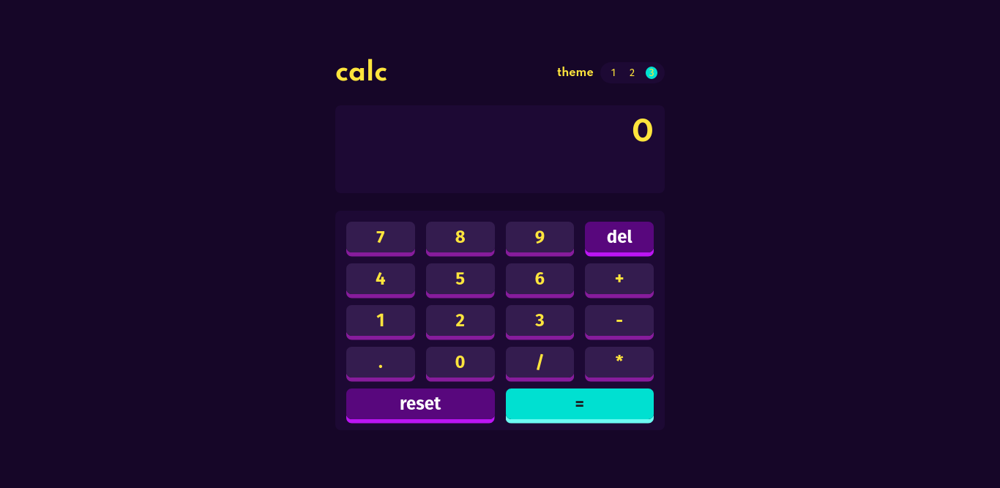

# Frontend Mentor - Calculator app solution

This is a solution to the [Calculator app challenge on Frontend Mentor](https://www.frontendmentor.io/challenges/calculator-app-9lteq5N29). Frontend Mentor challenges help you improve your coding skills by building realistic projects. 

## Table of contents

- [Overview](#overview)
  - [The challenge](#the-challenge)
  - [Screenshot](#screenshot)
  - [Links](#links)
- [My process](#my-process)
  - [Built with](#built-with)
  - [What I learned](#what-i-learned)
  - [Continued development](#continued-development)
  - [Useful resources](#useful-resources)
- [Author](#author)
- [Acknowledgments](#acknowledgments)

## Overview

### The challenge

Users should be able to:

- See the size of the elements adjust based on their device's screen size
- Perform mathmatical operations like addition, subtraction, multiplication, and division
- Adjust the color theme based on their preference
- **Bonus**: Have their initial theme preference checked using `prefers-color-scheme` and have any additional changes saved in the browser

### Screenshot

### Links

- Solution URL: [Calculator App GitHub](https://github.com/fredyranthun/calculator-app)
- Live Site URL: [Live URL (Vercel Deployed)](https://calculator-app-delta.vercel.app/)

## My process

### Built with

- [React](https://reactjs.org/) - JS library
- [Create React App](https://pt-br.reactjs.org/docs/create-a-new-react-app.html)
- [Styled Components](https://styled-components.com/) (was a great challenge for learning this amazing tool)
- CSS Grid - it is really amazing to see Grid working in a such a direct way. Recommend [Grid Generator](https://grid.layoutit.com/)
- A little bit of SASS.
- UseKeyPress hook for having the same behavior either you use a mouse or a keyboard.
- [polished](https://polished.js.org/docs/) - such an amazing tool for working with Styled Components. I recommend everybody who use Styled Components often to check it out!

### What I learned

Some points I would like to share on this project.
First: Styled Components is such a great tool and allow us to work with React Components in such beautiful way.
It was amazing to use it with a 'Theme Provider' component, and provide three different themes for the app.
I think there is some ways to accomplish this task, but using Styled Components was really a great way to do so.

Other interesting point was the use of CSS Grid. What an amazing tool! At the time I am finishing this project, the use of this tool is compatible with 95.45% of the browsers. Consider this while using this tool.

One amazing and challenging point: algorythm of calculator. Probably there is more elegant ways to accomplish the task, but it was really interesting to analyze client use and where the program could broke or bug.

If you want more help with writing markdown, we'd recommend checking out [The Markdown Guide](https://www.markdownguide.org/) to learn more.

### Useful resources

- [Polished](https://polished.js.org/) - As expressed above, great tool for using with styled components and JS.
- [Styled Components and Theme Provider](https://styled-components.com/)

## Author

- Website - [Fredy's Github](https://github.com/fredyranthun)
- Frontend Mentor - [@fredyranthun](https://www.frontendmentor.io/profile/fredyranthun)
- Twitter - [@fredy_ranthun](https://www.twitter.com/fredy_ranthun)

